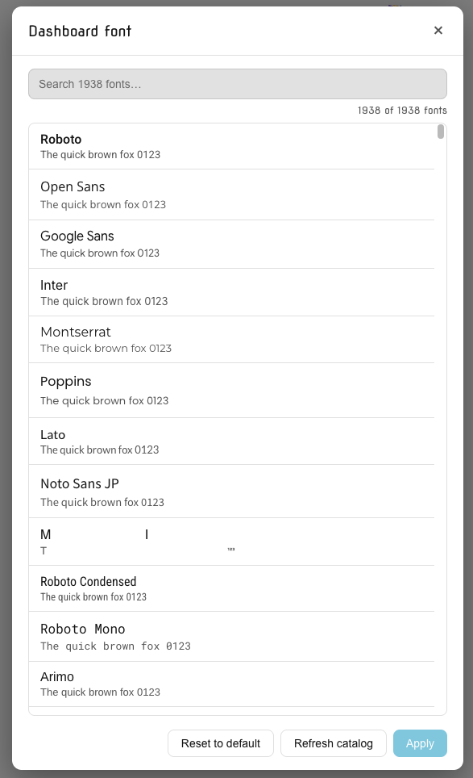
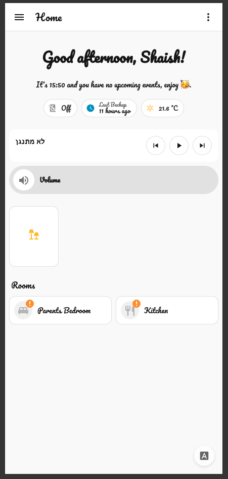
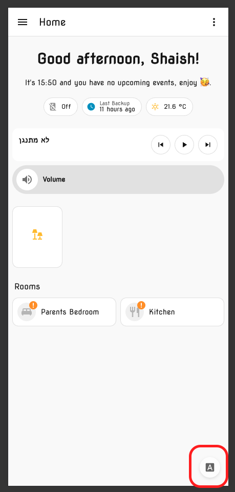

# Home Assistant Google Fonts

[](https://github.com/hacs/integration)

A Lovelace frontend plugin that lets each Home Assistant user pick any font from the [Google Fonts](https://fonts.google.com/) catalog and apply it across their dashboard. A floating gear button on the dashboard opens a searchable picker with live preview.

| Picker | Dashboard with custom font | Floating button |
| --- | --- | --- |
|  |  |  |

- **Per-user, per-dashboard**: each HA user picks a font on each dashboard separately. Stored via HA's `frontend.set_user_data`. The float button shows a colored dot when the current dashboard has a custom font.
- **All Google Fonts**: full live catalog (~1700 families), searchable.
- **Live preview**: every row in the picker renders in its own font.
- **Lovelace scope**: applies to dashboard cards/views (the part you actually look at). Sidebar, settings, and dialogs are intentionally untouched in v1.
- **Loaded on demand** from `fonts.googleapis.com` (standard Google Fonts CSS). Per-font CSS is cached by the browser.

## Install

### 1. Install via HACS (Custom repository)

1. In Home Assistant, open **HACS → Frontend → ⋮ → Custom repositories**.
2. Add `https://github.com/yshaish1/ha-google-fonts` with category **Lovelace**.
3. Find **Google Fonts** in the list and click **Download**.
4. Reload the page when prompted.

### 2. Get a Google Fonts API key (60 seconds, free, no billing)

The picker needs an API key to load the live font catalog. The key is yours; it's stored in your user profile in HA and only used by your browser.

1. Go to [Google Cloud Console → Web Fonts Developer API](https://console.cloud.google.com/apis/library/webfonts.googleapis.com)
2. (If prompted) accept Terms of Service and create a project (any name).
3. Click **Enable**.
4. Go to [APIs & Services → Credentials](https://console.cloud.google.com/apis/credentials).
5. Click **+ Create credentials → API key**. Copy the key.
6. (Recommended) Click the new key and under **API restrictions** restrict it to "Web Fonts Developer API".

### 3. Pick a font

1. Open any Lovelace dashboard.
2. Click the small floating gear button bottom-right.
3. Paste your API key, click **Save & Load Fonts**.
4. Search for a font, click a row to select it, click **Apply**.

To revert: open the dialog and click **Reset to default**.

## How it works

On page load the plugin reads your saved preference from `frontend/get_user_data`, injects a `<link rel="stylesheet">` for the chosen font, and writes a `<style>` block that sets `--primary-font-family`, `--mdc-typography-font-family`, and a couple of paper-element font variables. The `<style>` is injected into `document.head` plus the relevant Home Assistant shadow roots (`home-assistant`, `home-assistant-main`, `ha-panel-lovelace`, `hui-root`) so it actually reaches the dashboard surfaces.

A `MutationObserver` re-applies the font when you switch dashboards (since `hui-root` remounts).

Per-user persistence uses HA's built-in `frontend/set_user_data` WebSocket command. No backend code, no `custom_components`, no YAML.

## Privacy note

Selecting a font causes your browser to load CSS and font files from `fonts.googleapis.com` and `fonts.gstatic.com`. The Google Fonts API call also goes through your browser using your own API key. If you don't want any traffic going to Google, don't install this plugin.

## Troubleshooting

**The font isn't applied.** Hard-refresh the page (Cmd/Ctrl-Shift-R). HA caches frontend resources aggressively.

**API error 403 / "API has not been used".** Re-check that you enabled **Web Fonts Developer API** specifically (not "Cloud Fonts" or another product) and that the key isn't restricted in a way that excludes it.

**Some text doesn't change.** Out of scope in v1: sidebar, header, settings pages, and the more-info dialogs are not styled.

**My custom card looks the same.** Cards that hard-code their own `font-family` in shadow CSS won't be overridden. There's no clean fix without touching every card individually.

## Development

```bash
git clone https://github.com/yshaish1/ha-google-fonts
cd ha-google-fonts
npm install
npm run build      # writes dist/ha-google-fonts.js
npm run typecheck
```

For local testing without HACS, copy `dist/ha-google-fonts.js` to `<config>/www/ha-google-fonts.js` and add a Lovelace resource:

```yaml
url: /local/ha-google-fonts.js
type: module
```

## License

MIT
